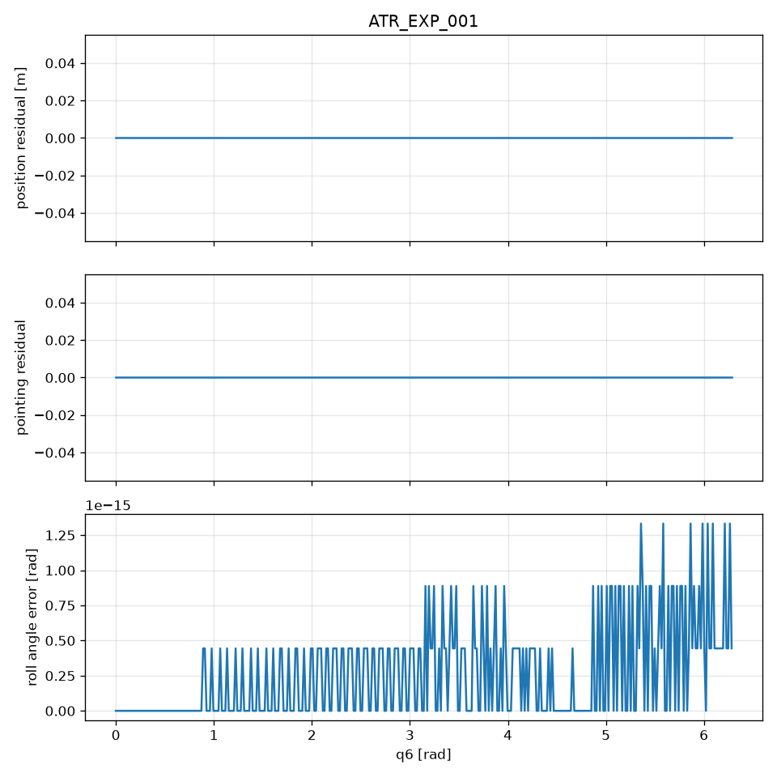

# ATR_EXP_001

**Status:** PASS
**Commit:** 0d27bb139c1a965dba91244f3df5096231b381da

## Expected

position invariant; pointing invariant; roll recovers Delta q6

## Observed

max|dp|=0.000e+00 m; max|dd|=0.000e+00; max roll err=1.332e-15 rad

## Metrics

- max position residual: 0.000000e+00 m
- max pointing residual: 0.000000e+00
- max roll angle error: 1.332268e-15 rad
- max roll axis misalignment: 0.000000e+00
- position_changes: False
- pointing_changes: False
- roll_recovered: True

## Figure

