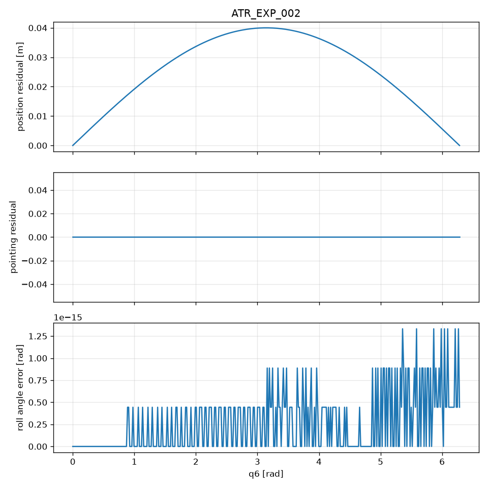

# ATR_EXP_002

**Status:** PASS
**Commit:** 0d27bb139c1a965dba91244f3df5096231b381da

## Expected

position changes; pointing invariant

## Observed

position_changes=True; pointing_changes=False; max|dp|=4.000e-02 m

## Metrics

- max position residual: 4.000000e-02 m
- max pointing residual: 0.000000e+00
- max roll angle error: 1.332268e-15 rad
- max roll axis misalignment: 0.000000e+00
- position_changes: True
- pointing_changes: False
- roll_recovered: True

## Figure

