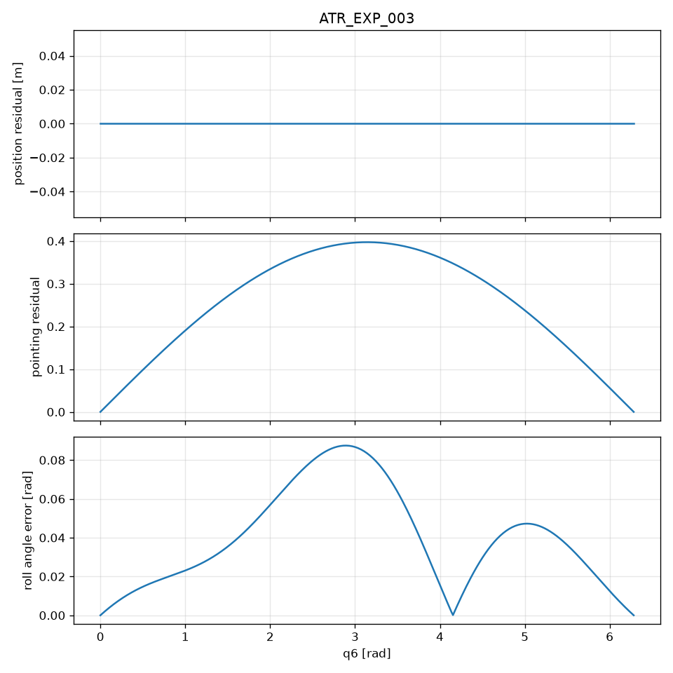

# ATR_EXP_003

**Status:** PASS
**Commit:** 0d27bb139c1a965dba91244f3df5096231b381da

## Expected

position invariant; pointing changes

## Observed

position_changes=False; pointing_changes=True; max|dd|=3.973e-01

## Metrics

- max position residual: 0.000000e+00 m
- max pointing residual: 3.973387e-01
- max roll angle error: 8.747656e-02 rad
- max roll axis misalignment: 2.781747e-01
- position_changes: False
- pointing_changes: True
- roll_recovered: False

## Figure

