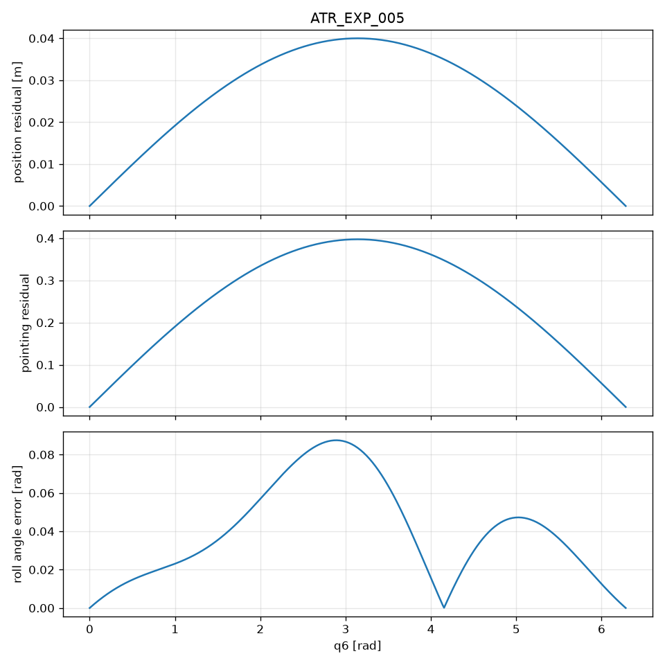

# ATR_EXP_005

**Status:** PASS
**Commit:** 0d27bb139c1a965dba91244f3df5096231b381da

## Expected

analytical vs central-FD derivative error converges over usable h

## Observed

h=0.01: dp_err=3.333e-07, dd_err=3.311e-06; h=0.001: dp_err=3.333e-09, dd_err=3.311e-08; h=0.0001: dp_err=3.336e-11, dd_err=3.312e-10; h=1e-05: dp_err=4.699e-13, dd_err=3.471e-12; h=1e-06: dp_err=5.174e-12, dd_err=3.713e-12

## Metrics

- max position residual: 4.000000e-02 m
- max pointing residual: 3.973387e-01
- max roll angle error: 8.711895e-02 rad
- max roll axis misalignment: 2.781747e-01
- position_changes: True
- pointing_changes: True
- roll_recovered: False

## Figure

